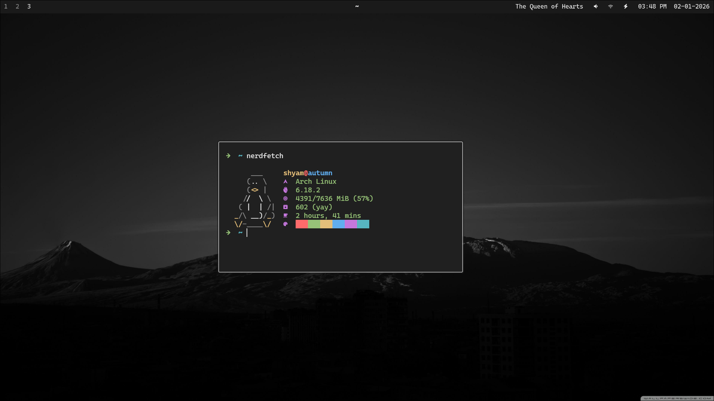

# dotfiles-black-minimal

A minimal, high-contrast, off-black Hyprland configuration designed for focus and aesthetic consistency.




This setup is built around a "Minimal Off-Black" theme (#1a1a1a background and #e6e6e6 foreground). It uses **Hyprland** as the compositor, **Waybar** for the status bar, and **Kitty** as the terminal emulator.

### Core Components
- **Compositor:** [Hyprland](https://hyprland.org/)
- **Terminal:** [Kitty](https://sw.kovidgoyal.net/kitty/)
- **Status Bar:** [Waybar](https://github.com/Alexays/Waybar)
- **Terminal:** [Kitty](https://sw.kovidgoyal.net/kitty/)
- **Text Editor:** [Neovim](https://neovim.io/)
- **Login Manager:** [SDDM](https://github.com/sddm/sddm) (with custom monochrome theme)
- **Application Launcher:** [Rofi](https://github.com/davatorium/rofi) (Wayland fork)
- **Shell:** [Zsh](https://www.zsh.org/) (custom minimal config)
- **Logout Menu:** [wlogout](https://github.com/ArtsyWork/wlogout)
- **Notification Daemon:** [Dunst](https://dunst-project.org/)
- **Wallpaper Utility:** [Swaybg](https://github.com/swaywm/swaybg)
- **Idle/Lock:** [Hypridle](https://github.com/hyprwm/hypridle) & [Hyprlock](https://github.com/hyprwm/hyprlock)

## 🚀 Installation & Setup

### 1. Clone the repository
```bash
git clone https://github.com/shyamjames/dotfiles-black-minimal.git ~/dotfiles-black-minimal
```

### 2. Install GNU Stow and symlink configurations
This repo uses [GNU Stow](https://www.gnu.org/software/stow/) to manage symlinks. Each top-level directory is a stow package that mirrors the target directory structure relative to `~`.

> [!IMPORTANT]
> Make sure to backup your existing configurations before running these commands.

```bash
# Install stow (Arch)
sudo pacman -S stow

# Stow all packages (creates symlinks in ~)
cd ~/dotfiles-black-minimal
stow hypr kitty waybar rofi wlogout dunst zsh

# SDDM theme must be copied manually (requires root)
sudo cp -r ~/dotfiles-black-minimal/sddm/monochrome /usr/share/sddm/themes/
```

To remove symlinks for a specific package:
```bash
stow -D hypr
```

To restow (remove + re-link) a package:
```bash
stow -R hypr
```

### 3. Configure SDDM (Login Screen)
Create the directory if it doesn't exist and define the current theme:
```bash
sudo mkdir -p /etc/sddm.conf.d
echo "[Theme]
Current=monochrome" | sudo tee /etc/sddm.conf.d/theme.conf
```

### 3. Dependencies
The following packages are required for this setup:

- `hyprland`
- `kitty`
- `waybar`
- `zsh`
- `rofi-lbonn-wayland-git`
- `wlogout`
- `dunst`
- `swaybg`
- `hypridle`
- `hyprlock`
- `thunar`
- `ttf-cascadia-code-nerd`
- `brightnessctl`
- `playerctl`
- `hyprshot`
- `cliphist`
- `neovim`
- `nodejs`
- `npm`
- `sddm`
- `imagemagick`
- `blueman`
- `bluez`
- `bluez-utils`
- `pipewire`
- `wireplumber`
- `pipewire-pulse`
- `pavucontrol`

> [!NOTE]
> This setup uses **PipeWire** with **WirePlumber** for audio. Ensure `pipewire`, `wireplumber`, and `pipewire-pulse` are installed and running for volume controls to work in Waybar.

> [!NOTE]
> This setup uses **CaskaydiaCove Nerd Font Mono** for icons and text. Ensure it is installed for the UI to render correctly.

## ⌨️ Keybindings
| Key | Action |
| --- | --- |
| `Super + Return` | Open Kitty |
| `Super + Q` | Kill Active Window |
| `Super + E` | Open Thunar |
| `Super + A` | Open Rofi App Launcher |
| `Super + V` | Clipboard History (Rofi) |
| `Super + B` | Open Brave Browser |
| `Super + Backspace` | Power Menu (Rofi) |
| `Super + Shift + W` | Reload Waybar |
| `Print` | Screenshot Menu (Fullscreen/Window/Area) |
